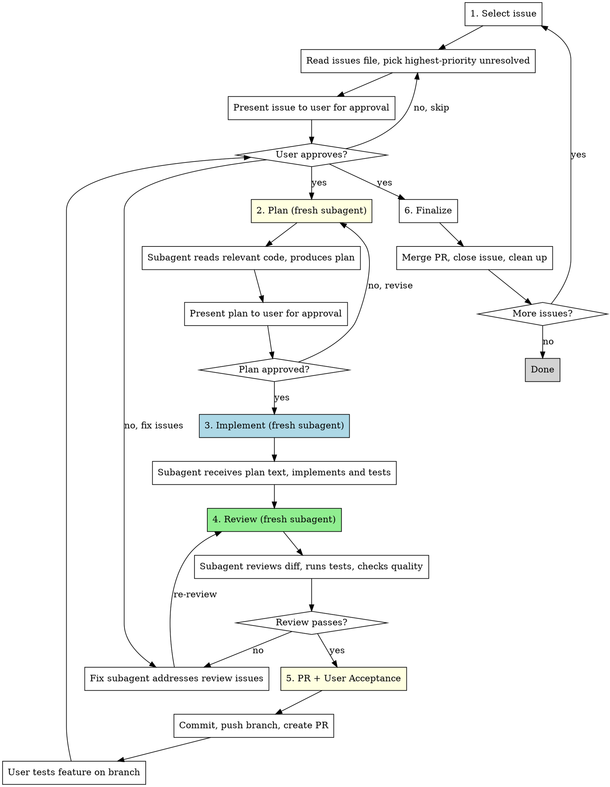

# Issue-Driven Development

Sequentially resolve GitHub issues. Each phase runs in a fresh subagent to prevent context bias.

## When to Use

- You have open GitHub issues to work through
- You want to work through them one at a time, highest priority first
- You want planning, implementation, and review isolated from each other

## The Process



## Git Worktree Isolation

**Every subagent that writes code MUST work in a git worktree**, not the main checkout. This prevents conflicts when running agents in the background or in parallel.

### Setup (controller does this before dispatching implementer)

```bash
# Create a branch and worktree for the issue
git branch issue-N-short-description main
git worktree add /tmp/worktree-issue-N issue-N-short-description
```

### Merge (controller does this after user accepts)

```bash
# Merge via GitHub PR (auto-merges when CI passes, deletes branch)
gh pr merge <PR-number> --merge --auto --delete-branch
```

### Teardown (controller does this after setting auto-merge)

```bash
git worktree remove /tmp/worktree-issue-N
# Remote branch is deleted by --delete-branch; local branch cleaned up here
git branch -d issue-N-short-description 2>/dev/null
```

### What this means for each phase

- **Planner**: Reads from the main checkout (read-only) — no worktree needed
- **Implementer**: Works in the worktree — all file paths in the prompt must use the worktree path
- **Reviewer**: Reads from the worktree — git diff and tests run from the worktree path
- **PR + User Acceptance**: Controller commits, pushes branch, creates PR, waits for user sign-off
- **Finalize**: Controller merges PR via `gh pr merge --auto`, cleans up worktree

## Phase Details

### 1. Select Issue (controller does this directly)

Run `gh issue list --state open --label <label>` to find open issues. Prioritize by label: `security` > `bug` > `tech-debt` > unlabeled. Within a priority level, pick the lowest-numbered issue. Use `gh issue view <number>` to get the full description. Present the issue to the user and get approval before proceeding.

### 2. Plan (fresh subagent)

Dispatch a `general-purpose` subagent with the issue text. Use `./planner-prompt.md` template. The planner:
- Reads relevant source files referenced in the issue (from main checkout)
- Explores surrounding code for context
- Produces a concrete plan: what to change, where, and why
- Specifies what tests to write (REQUIRED — see below)
- Does NOT write any code

Present the plan to the user. If rejected, dispatch a new planner with feedback.

### 3. Implement (fresh subagent)

Create a git worktree for this issue (see above). Then dispatch a `general-purpose` subagent with the approved plan text (not a file path). Use `./implementer-prompt.md` template. The implementer:
- Works in the worktree directory, NOT the main checkout
- Receives the full plan text and issue context
- Writes the tests specified in the plan FIRST
- Implements exactly what the plan specifies
- Runs all tests (`npm test`) from the worktree — new tests should now pass
- Does NOT commit (controller handles that after review)
- Reports what was changed, what tests were written, and test results

### 4. Review (fresh subagent)

Dispatch a `general-purpose` subagent to review the implementation. Use `./reviewer-prompt.md` template. The reviewer:
- Works in the worktree directory to read diffs and run tests
- Reads the git diff of uncommitted changes
- Compares implementation against the plan and original issue
- Verifies planned tests were written and actually test the fix
- Runs tests independently
- Checks for regressions, missed requirements, over-engineering
- Reports pass/fail with specific issues

If review fails, dispatch a fix subagent with the review feedback, then re-review.

### 5. PR + User Acceptance (controller does this directly)

After code review passes, the user must try the feature before it merges:

- Commit changes in the worktree branch
- Push branch to remote
- Create a PR via `gh pr create`
- **Present the PR to the user and ask them to review/test the feature**
- Wait for user approval before proceeding to finalize
- If the user requests changes, dispatch a fix subagent, then re-review (phase 4)

**Do NOT merge without user sign-off.** The user is the PM — they decide when a feature is ready to ship.

### 6. Finalize (controller does this directly)

- Merge PR via `gh pr merge <PR-number> --merge --auto --delete-branch` (merges when CI passes)
- GitHub auto-closes the issue if the commit message contains `fixes #N`
- Remove the worktree and delete the local branch
- Pull main to sync: `git pull origin main`
- Ask user if they want to continue to the next issue

## Key Rules

- **Never skip the user approval gate** after issue selection, after planning, and before merging
- **Never pass file paths to subagents** — pass the full text content
- **Always use a git worktree for implementation** — never modify the main checkout
- **Never let the implementer commit** — the controller commits after review passes
- **Each subagent gets a fresh context** — no resuming previous agents
- **Run tests in every phase** that touches code (implement and review)
- **Plan must specify tests, implementer must write them, reviewer must check them**
- **One issue at a time** — finish completely before moving to the next

## Batching Multiple Issues

Batch multiple **small, related** issues into one branch/PR to avoid sequential rebase+CI cycles from branch protection. Use one commit per issue for clean history.

**Batch when:**
- Issues are small AND related (same review category)
- Examples: several internal refactors, a group of dead code removals, related bug fixes

**Split into separate PRs when:**
- Issues cross review categories — UX/behavior changes need their own PR (user must review/test), internal refactors can merge without manual review
- The combined PR would be too large — prefer multiple parallel PRs over one giant PR

## Red Flags

- Implementing without a plan (skip phase 2)
- Plan without a concrete Tests section
- Implementer skipping test-writing ("existing tests pass" is not enough)
- Reviewer not checking whether planned tests were written
- Reviewer trusting implementer's report instead of reading the diff
- Committing before review passes
- Merging before the user has tested and approved the feature
- Moving to next issue with failing tests
- Implementer or reviewer working in the main checkout instead of a worktree
- Controller doing implementation work instead of delegating to subagent
