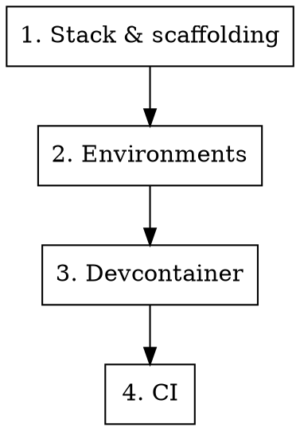

# New Project Setup

## Overview

Checklist for setting up a new project with proper development infrastructure. Each phase references a dedicated skill — invoke the relevant skill for detailed guidance.

## Setup Sequence

### 1. Stack & Scaffolding

Choose framework, hosting, database. Initialize the repo.

- **Skill:** `vercel-supabase-stack` (if using Vercel + Supabase)
- No skill needed for standard `create-next-app`, `cargo init`, etc.

### 2. Environments

Separate dev, test, and production credentials and config.

- **Skill:** `setting-up-environments`
- Set up `.env.local`, `.env.test`, production env vars
- Database per environment (or schema isolation)

### 3. Devcontainer

Set up containerized development for safe `--dangerously-skip-permissions` usage.

- **Skill:** `devcontainer-setup`
- Copy template, customize firewall domains, set up GitHub PAT
- Optional — skip if team prefers host-based development with permission allowlists

### 4. CI

Add continuous integration once you have tests.

- **Skill:** `setting-up-ci`
- Run tests on every push/PR
- Gate merges on CI passing

## Notes

- Phases 1-2 are essential for every project
- Phase 3 is recommended for projects where Claude Code does significant autonomous work
- Phase 4 depends on having tests — can be deferred until first tests are written

## Related Skills

- `branch-discipline` — all work on branches, never commit to main
- `test-discipline` — enforce after CI is set up
