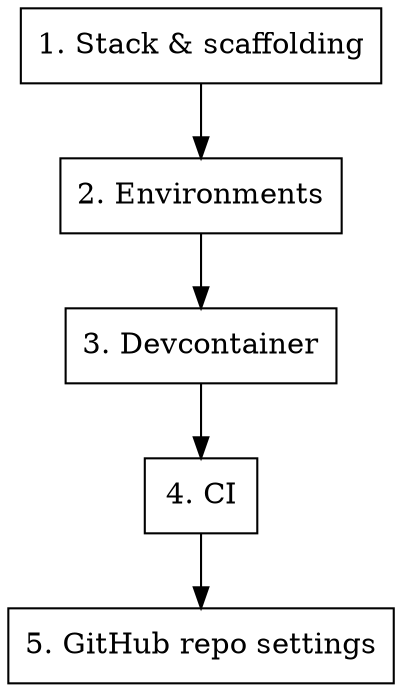

# New Project Setup

## Overview

Checklist for setting up a new project with proper development infrastructure. Each phase references a dedicated skill — invoke the relevant skill for detailed guidance.

## Setup Sequence



### 1. Stack & Scaffolding

Choose framework, hosting, database. Initialize the repo.

- **Skill:** `vercel-supabase-stack` (if using Vercel + Supabase)
- No skill needed for standard `create-next-app`, `cargo init`, etc.

### 2. Environments

Separate dev, test, and production credentials and config.

- **Skill:** `setting-up-environments`
- Set up `.env.local`, `.env.test`, production env vars
- Database per environment (or schema isolation)

### 3. Devcontainer

Set up containerized development for safe `--dangerously-skip-permissions` usage.

- **Skill:** `devcontainer-setup`
- Copy template, customize firewall domains, set up GitHub PAT
- Optional — skip if team prefers host-based development with permission allowlists

### 4. CI

Add continuous integration once you have tests.

- **Skill:** `setting-up-ci`
- Run tests on every push/PR
- Gate merges on CI passing

### 5. GitHub Repo Settings

Configure the repo to match the standard setup (modeled on jasoncrawford/brunel). Run these after CI is set up and you know your job names.

**Merge strategy — merge commits only, auto-delete branches, allow auto-merge:**
```bash
gh api repos/OWNER/REPO -X PATCH \
  -f allow_squash_merge=false \
  -f allow_rebase_merge=false \
  -f allow_merge_commit=true \
  -f allow_auto_merge=true \
  -f delete_branch_on_merge=true
```

**Branch protection on main — require CI to pass, enforce on admins, no required reviews:**

Replace `JOB1 JOB2 ...` with your actual CI job names (e.g. `test`, `browser-test`).

```bash
gh api repos/OWNER/REPO/branches/main/protection -X PUT \
  --input - <<'EOF'
{
  "required_status_checks": {
    "strict": true,
    "contexts": ["JOB1", "JOB2"]
  },
  "required_pull_request_reviews": {
    "dismiss_stale_reviews": false,
    "require_code_owner_reviews": false,
    "required_approving_review_count": 0
  },
  "enforce_admins": true,
  "restrictions": null,
  "required_linear_history": false,
  "allow_force_pushes": false,
  "allow_deletions": false,
  "required_conversation_resolution": false
}
EOF
```

**Security features (secret scanning, push protection, Dependabot):**
```bash
gh api repos/OWNER/REPO -X PATCH \
  -f security_and_analysis[secret_scanning][status]=enabled \
  -f security_and_analysis[secret_scanning_push_protection][status]=enabled

gh api repos/OWNER/REPO/vulnerability-alerts -X PUT
```

**What this gives you:**
- PRs are required (CI must pass before auto-merge fires)
- No human review approval needed — CI is the gate
- Auto-merge fires as soon as all required checks pass
- Branches auto-delete after merge
- Force pushes and branch deletions blocked on main
- Rules apply to admins too (`enforce_admins`)
- Secret scanning and Dependabot security alerts active

## Notes

- Phases 1-2 are essential for every project
- Phase 3 is recommended for projects where Claude Code does significant autonomous work
- Phase 4 depends on having tests — can be deferred until first tests are written
- Phase 5 should be done after Phase 4 so you know the CI job names to require

## Related Skills

- `branch-discipline` — all work on branches, never commit to main
- `test-discipline` — enforce after CI is set up
