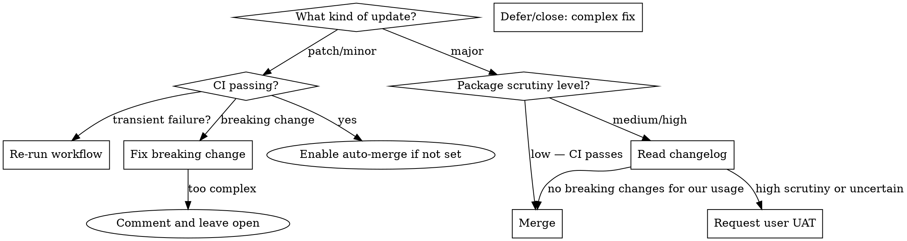

# Reviewing Dependabot PRs

## Overview

Patch and minor bumps auto-merge via the `dependabot-automerge.yml` workflow when CI passes. This skill covers the cases that need active review: **major version bumps** and **failing CI**.

## Decision Flowchart



## Package Scrutiny Levels

**Low — merge after CI passes, no changelog needed:**
- `@types/*` — TypeScript definitions only, no runtime behavior
- GitHub Actions (`actions/checkout`, `actions/setup-node`, etc.)
- Pure dev tooling with minimal direct API surface (vitest, eslint, prettier, typescript)

**Medium — skim the changelog, check for breaking changes in your usage:**
- Runtime deps with small API surface you call directly (dotenv, tsx, env-cmd)
- Build tools that affect output (vite, tailwind)
- Utility libraries (octokit, resend, playwright)

**High — read migration guide carefully, consider user UAT:**
- Framework majors (Next.js, React)
- Data/auth layer (Supabase client, `@supabase/ssr`)
- Anything in the critical path of the app's core feature

## Reading the Changelog

Search for: **removed**, **breaking**, **migration**, **deprecated**, **no longer**

Specifically check:
- Were APIs you're calling removed or renamed?
- Did defaults change in a way that affects behavior?
- Did peer dependency requirements change (e.g. now requires Node 22+)?
- Is there a migration guide? If so, read it.

If the changelog mentions none of your usage patterns → safe to merge.

If uncertain → request user UAT (see below).

## Fixing Failing CI on a Dependabot Branch

First, check if it's a transient failure — re-run the job. If it's real:

```bash
# Check out the Dependabot branch
git fetch origin
git checkout dependabot/npm_and_yarn/package-name-X.Y.Z

# Read the failure, make the fix
# ... edit files ...

git add <files>
git commit -m "fix: update usage for package-name vX breaking change"
git push
```

CI will re-run. If it passes, the PR can be merged.

**If the fix is non-trivial** (requires understanding business logic, affects tests, or touches core features), don't guess. Leave a comment on the PR explaining what broke and why it needs human attention, and leave the PR open. Don't close it — Dependabot will just recreate it noisily, and leaving it open keeps it visible for the human to act on.

Note: Dependabot may overwrite your branch if it rebases. If that happens, your commits disappear — you may need to re-apply the fix or ask the user to handle it.

## Merging

Once satisfied the PR is safe:

```bash
gh pr merge <number> --repo jasoncrawford/<repo> --merge
```

Always use `--merge` (merge commit), not `--squash` or `--rebase`. This matches the repo's branch discipline.

## Requesting User UAT

Use this when:
- High-scrutiny package with a major bump
- CI failure you can't safely fix
- Changelog mentions behavior changes that touch core features but don't break CI

Tell the user:
1. **What package** and what version change
2. **Why you're flagging it** (what changed)
3. **What to test** — specific behaviors or flows to exercise manually

Example:
> `@supabase/supabase-js` is bumping from v2 → v3. The changelog notes changes to how auth sessions are persisted and how realtime subscriptions are initialized. Before merging I'd suggest: (1) sign in and out and confirm session survives a page refresh, (2) confirm live updates still appear in the task list. CI passes but these are behaviors unit tests don't cover.
